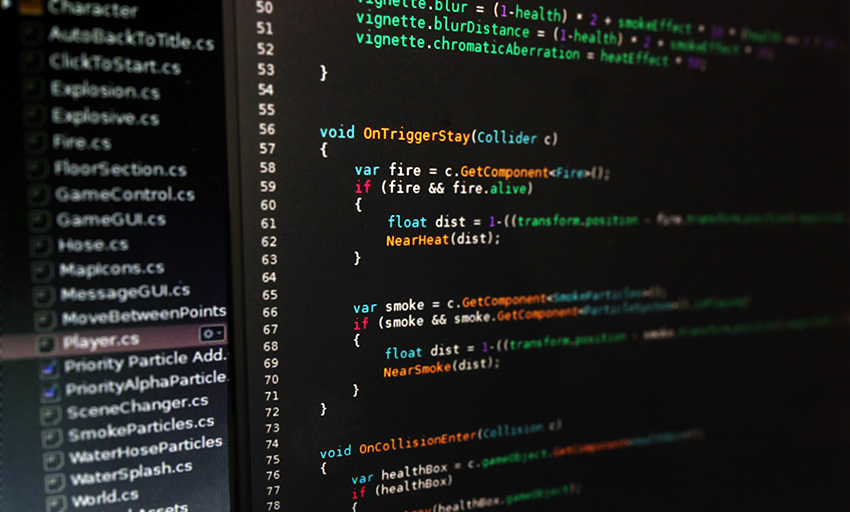
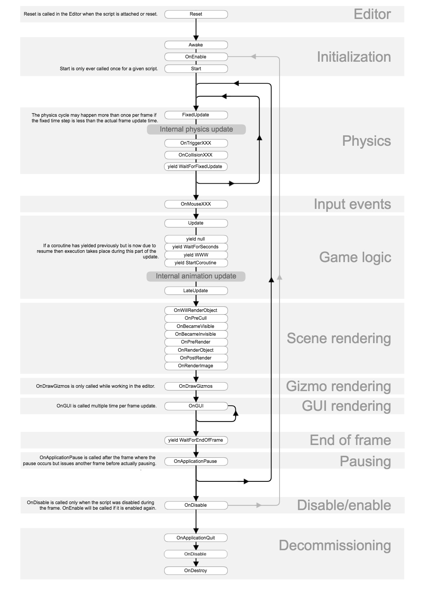

# Useful Stuff in Unity Scripting



## MonoBehaviour

[MonoBehaviour](https://docs.unity3d.com/ScriptReference/MonoBehaviour.html)

> `MonoBehaviour` is the base class from which every Unity script derives.

Note: There is a checkbox for disabling `MonoBehaviour` on the Unity Editor; it disables `Start()`, `Awake()`, `Update()`, `FixedUpdate()`, and `OnGUI()` from executing when unticked. If none of these functions are present in the script, the Editor does not display the checkbox.

-------

[MonoBehaviour.StartCoroutine](https://docs.unity3d.com/ScriptReference/MonoBehaviour.StartCoroutine.html)

* `public Coroutine StartCoroutine(IEnumerator routine);`

> Starts a coroutine.

```c#
public class ExampleClass : MonoBehaviour {
    IEnumerator Start() {
        print("Starting " + Time.time);
        yield return StartCoroutine(WaitAndPrint(2.0F));
        print("Done " + Time.time);
    }
    IEnumerator WaitAndPrint(float waitTime) {
        yield return new WaitForSeconds(waitTime);
        print("WaitAndPrint " + Time.time);
    }
}
```

* `public Coroutine StartCoroutine(string methodName, object value = null);`

> Starts a coroutine named `methodName`.
> In most cases you want to use the StartCoroutine variation above. However StartCoroutine using a string method name allows you to use `StopCoroutine` with a specific method name. The downside is that the string version has a higher runtime overhead to start the coroutine and you can pass only one parameter.

```c#
public class ExampleClass : MonoBehaviour {
    IEnumerator Start() {
        StartCoroutine("DoSomething", 2.0F);
        yield return new WaitForSeconds(1);
        StopCoroutine("DoSomething");
    }
    IEnumerator DoSomething(float someParameter) {
        while (true) {
            print("DoSomething Loop");
            yield return null;
        }
    }
}
```

-------

[MonoBehaviour.StopCoroutine](https://docs.unity3d.com/ScriptReference/MonoBehaviour.StopCoroutine.html)

* `public void StopCoroutine(string methodName);`
* `public void StopCoroutine(IEnumerator routine);`

> Stops the first coroutine named `methodName`, or the coroutine stored in `routine` running on this behaviour.
> StopCoroutine takes one of two arguments which specify which coroutine is stopped:
> 
> - A string function naming the active coroutine
> - The IEnumerator variable used earlier to create the coroutine.

```c#
public class Example : MonoBehaviour
{
    private IEnumerator coroutine;
    void Start()
    {
        print("Starting " + Time.time);
        coroutine = WaitAndPrint(3.0f);
        StartCoroutine(coroutine);
        print("Done " + Time.time);
    }

    // print to the console every 3 seconds.
    // yield is causing WaitAndPrint to pause every 3 seconds
    public IEnumerator WaitAndPrint(float waitTime)
    {
        while (true)
        {
            yield return new WaitForSeconds(waitTime);
            print("WaitAndPrint " + Time.time);
        }
    }

    void Update()
    {
        if (Input.GetKeyDown("space"))
        {
            StopCoroutine(coroutine);
            print("Stopped " + Time.time);
        }
    }
}
```

## GameObject

[GameObject](https://docs.unity3d.com/ScriptReference/GameObject.html)

> Base class for all entities in Unity scenes.

-------

[Object.Instantiate](https://docs.unity3d.com/ScriptReference/Object.Instantiate.html)
    
* `public static Object Instantiate(Object original, Vector3 position, Quaternion rotation);`

> Clones the object original and returns the clone.

```c#
public class ExampleClass : MonoBehaviour {
    public Rigidbody projectile;
    void Update() {
        if (Input.GetButtonDown("Fire1")) {
            Rigidbody clone;
            clone = Instantiate(projectile, transform.position, transform.rotation) as Rigidbody;
            clone.velocity = transform.TransformDirection(Vector3.forward * 10);
        }
    }
}
```

-------

[GameObject.GetComponent](https://docs.unity3d.com/ScriptReference/GameObject.GetComponent.html)

* `public Component GetComponent<T>();`

> Returns the component of Type type if the game object has one attached, null if it doesn't.

**See Also: GetComponents, GetComponentInParent, GetComponentInChildren.**

```c#
public class GetComponentExample : MonoBehaviour
{
    void Start()
    {
        HingeJoint hinge = gameObject.GetComponentInParent<HingeJoint>();
        if (hinge != null)
            hinge.useSpring = false;
    }
}
```

-------

[Object.Destroy](https://docs.unity3d.com/ScriptReference/Object.Destroy.html)

* `public static void Destroy(Object obj, float t = 0.0F);`

> Removes a gameobject, component or asset.
> The object `obj` will be destroyed now or if a time is specified `t` seconds from now. If `obj` is a Component it will remove the component from the GameObject and destroy it. If `obj` is a GameObject it will destroy the GameObject, all its components and all transform children of the GameObject. 

Actual object destruction is always delayed until after the current Update loop, but will always be done before rendering.

```c#
// Kills the game object
Destroy(gameObject);

// Removes this script instance from the game object
Destroy(this);

// Removes the rigidbody from the game object
Destroy(rigidbody);

// Kills the game object in 5 seconds after loading the object
Destroy(gameObject, 5);

// When the user presses Ctrl, it will remove the script named FooScript from the game object
void Update()
{
    if (Input.GetButton("Fire1") && GetComponent<FooScript>())
    {
        Destroy(GetComponent<FooScript>());
    }
}
```

-------

[GameObject.CreatePrimitive](https://docs.unity3d.com/ScriptReference/GameObject.CreatePrimitive.html)

* `public static GameObject CreatePrimitive(PrimitiveType type);`

> Creates a game object with a primitive mesh renderer and appropriate collider.

```c#
public class ExampleClass : MonoBehaviour {
    void Start() {
        GameObject cube = GameObject.CreatePrimitive(PrimitiveType.Cube);
        cube.transform.position = new Vector3(0, 0.5F, 0);
     }
}
```

## Transform

[Transform](https://docs.unity3d.com/ScriptReference/Transform.html)

> Position, rotation and scale of an object.

-------

[Transform.parent](https://docs.unity3d.com/ScriptReference/Transform-parent.html)

* `public Transform parent;`

> The parent of the transform.

-------

[Transform.position](https://docs.unity3d.com/ScriptReference/Transform-position.html)

* `public Vector3 position;`
    
> The position of the transform in world space.

-------

[Transform.rotation](https://docs.unity3d.com/ScriptReference/Transform-rotation.html)

* `public Quaternion rotation;`

> The rotation of the transform in world space stored as a Quaternion.

-------

[Transform.Translate](https://docs.unity3d.com/ScriptReference/Transform.Translate.html)

* `public void Translate(Vector3 translation, Space relativeTo = Space.Self);`

> Moves the transform in the direction and distance of translation.

```c#
public class ExampleClass : MonoBehaviour {
    void Update() {
        transform.Translate(Vector3.forward * Time.deltaTime);
        transform.Translate(Vector3.up * Time.deltaTime, Space.World);
    }
}
```

-------

[Transform.Rotate](https://docs.unity3d.com/ScriptReference/Transform.Rotate.html)

* `public void Rotate(Vector3 eulerAngles, Space relativeTo = Space.Self);`

> Applies a rotation of eulerAngles.z degrees around the z axis, eulerAngles.x degrees around the x axis, and eulerAngles.y degrees around the y axis (in that order).

```c#
public class ExampleClass : MonoBehaviour
{
    void Update()
    {
        // Rotate the object around its local X axis at 1 degree per second
        transform.Rotate(Vector3.right * Time.deltaTime);

        // ...also rotate around the World's Y axis
        transform.Rotate(Vector3.up * Time.deltaTime, Space.World);
    }
}
```

-------

[Transform.localScale](https://docs.unity3d.com/ScriptReference/Transform-localScale.html)

* `public Vector3 localScale;`

> The scale of the transform relative to the parent.

```c#
public class ExampleClass : MonoBehaviour
{
    void Example()
    {
        // Widen the object by 0.1
        transform.localScale += new Vector3(0.1F, 0, 0);
    }
}
```

-------

[Transform.localEulerAngles](https://docs.unity3d.com/ScriptReference/Transform-localEulerAngles.html)

* `public Vector3 localEulerAngles;`

> The rotation as Euler angles in degrees relative to the parent transform's rotation.
> The x, y, and z angles represent a rotation z degrees around the z axis, x degrees around the x axis, and y degrees around the y axis (in that order).
> **Only use this variable to read and set the angles to absolute values. Don't increment them, as it will fail when the angle exceeds 360 degrees. Use Transform.Rotate instead.**

-------

[Transform.TransformDirection](https://docs.unity3d.com/ScriptReference/Transform.TransformDirection.html)

* `public Vector3 TransformDirection(Vector3 direction);`

> Transforms direction from local space to world space.
> This operation is not affected by `scale` or `position` of the transform. The returned vector has the same length as `direction`.

You should use `Transform.TransformPoint` for the conversion if the vector represents a position rather than a direction.

-------

[Transform.InverseTransformDirection](https://docs.unity3d.com/ScriptReference/Transform.InverseTransformDirection.html)

* `public Vector3 InverseTransformDirection(Vector3 direction);`

> Transforms a direction from world space to local space. The opposite of `Transform.TransformDirection`.
> This operation is unaffected by `scale`.

You should use `Transform.InverseTransformPoint` if the vector represents a position in space rather than a direction.

```c#
public class ExampleClass : MonoBehaviour {
    private Vector3 relative;
    void Example() {
        relative = transform.InverseTransformDirection(Vector3.forward);
        Debug.Log(relative);
    }
}
```

-------

[Transform.TransformPoint](https://docs.unity3d.com/ScriptReference/Transform.TransformPoint.html)

* `public Vector3 TransformPoint(Vector3 position);`

> Transforms position from local space to world space.

Note that the returned position is affected by `scale`. Use `Transform.TransformDirection` if you are dealing with direction vectors.
You can perform the opposite conversion, from world to local space using `Transform.InverseTransformPoint`.

-------

[Transform.InverseTransformPoint](https://docs.unity3d.com/ScriptReference/Transform.InverseTransformPoint.html)

* `public Vector3 InverseTransformPoint(Vector3 position);`

> Transforms position from world space to local space.

This function is essentially the opposite of `Transform.TransformPoint`, which is used to convert from local to world space.
Note that the returned position is affected by `scale`. Use `Transform.InverseTransformDirection` if you are dealing with direction vectors rather than positions.

```c#
// Calculate the transform's position relative to the camera.
public class ExampleClass : MonoBehaviour
{
    public Transform cam;
    public Vector3 cameraRelative;
    
    void Start()
    {
        cam = Camera.main.transform;
        Vector3 cameraRelative = cam.InverseTransformPoint(transform.position);
        if (cameraRelative.z > 0)
            print("The object is in front of the camera");
        else
            print("The object is behind the camera");
    }
}
```

## Quaternion

[四元数（Quaternion）和旋转](http://blog.csdn.net/candycat1992/article/details/41254799)

[Quaternion](https://docs.unity3d.com/ScriptReference/Quaternion.html)

> Quaternions are used to represent rotations.

-------

[Quaternion.identity](https://docs.unity3d.com/ScriptReference/Quaternion-identity.html)

* `public static Quaternion identity;`

> The identity rotation (Read Only).
> This quaternion corresponds to "no rotation" - the object is perfectly aligned with the world or parent axes.

## Vector3

[Vector3](https://docs.unity3d.com/ScriptReference/Vector3.html)

> Representation of 3D vectors and points.

-------

[Vector3.magnitude](https://docs.unity3d.com/ScriptReference/Vector3-magnitude.html)

* `public float magnitude;`

> Returns the length of this vector (Read Only).
> The length of the vector is square root of (x*x+y*y+z*z).

If you only need to compare magnitudes of some vectors, you can compare squared magnitudes of them using sqrMagnitude (computing squared magnitudes is faster).

-------

[Vector3.sqrMagnitude](https://docs.unity3d.com/ScriptReference/Vector3-sqrMagnitude.html)

* `public float sqrMagnitude;`

> Returns the squared length of this vector (Read Only).

```c#
public class ExampleClass : MonoBehaviour {
    public Transform other;
    public float closeDistance = 5.0F;
    void Update() {
        if (other) {
            Vector3 offset = other.position - transform.position;
            float sqrLen = offset.sqrMagnitude;
            if (sqrLen < closeDistance * closeDistance)
                print("The other transform is close to me!");
        }
    }
}
```

-------

[Vector3.ClampMagnitude](https://docs.unity3d.com/ScriptReference/Vector3.ClampMagnitude.html)

* `public static Vector3 ClampMagnitude(Vector3 vector, float maxLength);`

> Returns a copy of vector with its magnitude clamped to maxLength.

```c#
public class ExampleClass : MonoBehaviour {
    public Vector3 centerPt;
    public float radius;
    void Update() {
        Vector3 movement = new Vector3(Input.GetAxis("Horizontal"), 0, Input.GetAxis("Vertical"));
        Vector3 newPos = transform.position + movement;
        Vector3 offset = newPos - centerPt;
        transform.position = centerPt + Vector3.ClampMagnitude(offset, radius);
    }
}
```

## Rigidbody

[Rigidbody](https://docs.unity3d.com/ScriptReference/Rigidbody.html)

> Control of an object's position through physics simulation.
> **Adding a Rigidbody component to an object will put its motion under the control of Unity's physics engine.** Even without adding any code, a Rigidbody object will be pulled downward by gravity and will react to collisions with incoming objects if the right Collider component is also present.
>**In a script, the FixedUpdate function is recommended as the place to apply forces and change Rigidbody settings (as opposed to Update, which is used for most other frame update tasks).**

-------

[Rigidbody.freezeRotation](https://docs.unity3d.com/ScriptReference/Rigidbody-freezeRotation.html)

* `public bool freezeRotation;`

> Controls whether physics will change the rotation of the object.
> **If freezeRotation is enabled, the rotation is not modified by the physics simulation. This is useful for creating first person shooters, because the player needs full control of the rotation using the mouse.**

## Collider

[Collider](https://docs.unity3d.com/ScriptReference/Collider.html)

> A base class of all colliders.
> **If the object with the Collider needs to be moved during gameplay then you should also attach a Rigidbody component to the object. The Rigidbody can be set to be kinematic if you don't want the object to have physical interaction with other objects.**

**See Also: BoxCollider, SphereCollider, CapsuleCollider, MeshCollider, PhysicMaterial.**

## CharacterController

[CharacterController](https://docs.unity3d.com/ScriptReference/CharacterController.html)

> A `CharacterController` allows you to easily do movement constrained by collisions without having to deal with a rigidbody.
> A `CharacterController` is not affected by forces and will only move when you call the `Move` funtion. It will then carry out the movement but be constrained by collisions.

-------

[CharacterController.Move](https://docs.unity3d.com/ScriptReference/CharacterController.Move.html)

* `public CollisionFlags Move(Vector3 motion);`

> A more complex move function taking absolute movement deltas.

## Camera

[Camera](https://docs.unity3d.com/ScriptReference/Camera.html)

> A `Camera` is a device through which the player views the world.

* A `screen space point` is defined in pixels. The bottom-left of the screen is (0,0); the right-top is (`pixelWidth`,`pixelHeight`). The z position is in world units from the Camera.
* A `viewport space point` is normalized and relative to the Camera. The bottom-left of the Camera is (0,0); the top-right is (1,1). The z position is in world units from the Camera.
* A `world space point` is defined in global coordinates (for example, Transform.position).

-------

[Camera.main](https://docs.unity3d.com/ScriptReference/Camera-main.html)

* `public static Camera main;`

> The first enabled camera tagged "`MainCamera`" (Read Only).

-------

[Camera.pixelWidth](https://docs.unity3d.com/ScriptReference/Camera-pixelWidth.html)

* `public int pixelWidth;`

> How wide is the camera in pixels (Read Only).

-------

[Camera.pixelHeight](https://docs.unity3d.com/ScriptReference/Camera-pixelHeight.html)

* `public int pixelHeight;`

> How tall is the camera in pixels (Read Only).

-------

[Camera.ScreenPointToRay](https://docs.unity3d.com/ScriptReference/Camera.ScreenPointToRay.html)

* `public Ray ScreenPointToRay(Vector3 position);`

> Returns a ray going from camera through a screen point.
> Resulting ray is in world space, starting on the near plane of the camera and going through position's (x,y) pixel coordinates on the screen (position.z is ignored).
> Screenspace is defined in pixels. The bottom-left of the screen is `(0,0)`; the right-top is `(pixelWidth,pixelHeight)`.

```c#
// Draws a line in the scene view going through a point 200 pixels from the lower-left corner of the screen
public class ExampleClass : MonoBehaviour
{
    Camera camera;
    void Start()
    {
        camera = GetComponent<Camera>();
    }
    void Update()
    {
        Ray ray = camera.ScreenPointToRay(new Vector3(200, 200, 0));
        Debug.DrawRay(ray.origin, ray.direction * 10, Color.yellow);
    }
}
```

## Input

[Input](https://docs.unity3d.com/ScriptReference/Input.html)

> Use this class to read the axes set up in the `Input Manager`, and to access multi-touch/accelerometer data on mobile devices.
> To read an axis use `Input.GetAxis` with one of the following default axes: "`Horizontal`" and "`Vertical`" are mapped to joystick, A, W, S, D and the arrow keys. "`Mouse X`" and "`Mouse Y`" are mapped to the mouse delta. "`Fire1`", "`Fire2`" "`Fire3`" are mapped to Ctrl, Alt, Cmd keys and three mouse or joystick buttons. New input axes can be added in the Input Manager.

Note also that the `Input` flags are not reset until "`Update()`", so its suggested you make all the `Input Calls` in the `Update` Loop.

-------

[Input.GetAxis](https://docs.unity3d.com/ScriptReference/Input.GetAxis.html)

* `public static float GetAxis(string axisName);`

> Returns the value of the virtual axis identified by axisName.
> The value will be in the range -1...1 for keyboard and joystick input. If the axis is setup to be delta mouse movement, the mouse delta is multiplied by the axis sensitivity and the range is not -1...1.

This is frame-rate independent; you do not need to be concerned about varying frame-rates when using this value.

```c#
public class ExampleClass : MonoBehaviour {
    public float speed = 10.0F;
    public float rotationSpeed = 100.0F;
    void Update() {
        float translation = Input.GetAxis("Vertical") * speed;
        float rotation = Input.GetAxis("Horizontal") * rotationSpeed;
        translation *= Time.deltaTime;
        rotation *= Time.deltaTime;
        transform.Translate(0, 0, translation);
        transform.Rotate(0, rotation, 0);
    }
}
```

-------

[Input.GetAxisRaw](https://docs.unity3d.com/ScriptReference/Input.GetAxisRaw.html)

* `public static float GetAxisRaw(string axisName);`

> Returns the value of the virtual axis identified by axisName with no smoothing filtering applied.
> The value will be in the range -1...1 for keyboard and joystick input. Since input is not smoothed, keyboard input will always be either -1, 0 or 1. This is useful if you want to do all smoothing of keyboard input processing yourself.

```c#
public class ExampleClass : MonoBehaviour {
    void Update() {
        float speed = Input.GetAxisRaw("Horizontal") * Time.deltaTime;
        transform.Rotate(0, speed, 0);
    }
}
```

-------

[Input.GetButton](https://docs.unity3d.com/ScriptReference/Input.GetButton.html)

* `public static bool GetButton(string buttonName);`

> Returns true while the virtual button identified by buttonName is held down.
> Think auto fire - this will return true as long as the button is held down.

Use this only when implementing events that trigger an action, eg, shooting a weapon. Use `GetAxis` for input that controls continuous movement.

```c#
// Instantiates a projectile every 0.5 seconds, if the Fire1 button (default is Ctrl) is pressed.
public class ExampleClass : MonoBehaviour
{
    public GameObject projectile;
    public float fireDelta = 0.5F;

    private float nextFire = 0.5F;
    private GameObject newProjectile;
    private float myTime = 0.0F;

    void Update()
    {
        myTime = myTime + Time.deltaTime;
        if (Input.GetButton("Fire1") && myTime > nextFire)
        {
            nextFire = myTime + fireDelta;
            newProjectile = Instantiate(projectile, transform.position, transform.rotation) as GameObject;

            // create code here that animates the newProjectile

            nextFire = nextFire - myTime;
            myTime = 0.0F;
        }
    }
}
```

-------

[Input.GetButtonDown](https://docs.unity3d.com/ScriptReference/Input.GetButtonDown.html)

* `public static bool GetButtonDown(string buttonName);`

> Returns true during the frame the user pressed down the virtual button identified by buttonName.
> You need to call this function from the `Update` function, since the state gets reset each frame. It will not return true until the user has released the key and pressed it again.

Use this only when implementing action like events IE: shooting a weapon.
Use `Input.GetAxis` for any kind of movement behaviour.

```c#
public class ExampleClass : MonoBehaviour
{
    public GameObject projectile;
    void Update()
    {
        if (Input.GetButtonDown("Fire1"))
            Instantiate(projectile, transform.position, transform.rotation);
    }
}
```

-------

[Input.GetMouseButton](https://docs.unity3d.com/ScriptReference/Input.GetMouseButton.html)

* `public static bool GetMouseButton(int button);`

> Returns whether the given mouse button is held down.

button values are `0` for `left button`, `1` for `right button`, `2` for the `middle button`.

-------

[Input.GetMouseButtonDown](https://docs.unity3d.com/ScriptReference/Input.GetMouseButtonDown.html)

* `public static bool GetMouseButtonDown(int button);`

> Returns `true` during the frame the user pressed the given mouse button.

You need to call this function from the `Update` function, since the state gets reset each frame. It will not return `true` until the user has released the mouse button and pressed it again.

## Time

[Time](https://docs.unity3d.com/ScriptReference/Time.html)

-------

[Time.deltaTime](https://docs.unity3d.com/ScriptReference/Time-deltaTime.html)

* `public static float deltaTime;`

> The time in seconds it took to complete the last frame (Read Only).

Use this function to make your game frame rate independent.

If you add or subtract to a value every frame chances are you should multiply with `Time.deltaTime`. When you multiply with `Time.deltaTime` you essentially express: I want to move this object 10 meters per second instead of 10 meters per frame.

When called from inside MonoBehaviour's `FixedUpdate`, returns the fixed framerate delta time.

Note that you should not rely on `Time.deltaTime` from inside `OnGUI` since OnGUI can be called multiple times per frame and deltaTime would hold the same value each call, until next frame where it would be updated again.

```c#
public class ExampleClass : MonoBehaviour {
    void Update() {
        float translation = Time.deltaTime * 10;
        transform.Translate(0, 0, translation);
    }
}
```

-------

[Time.timeScale](https://docs.unity3d.com/ScriptReference/Time-timeScale.html)

> The scale at which the time is passing. This can be used for slow motion effects.

When `timeScale` is `1.0` the time is passing as fast as realtime. When `timeScale` is `0.5` the time is passing `2x` slower than realtime.

When `timeScale` is set to `zero` the game is basically **paused** if all your functions are frame rate independent.

Except for `realtimeSinceStartup`, `timeScale` **affects all the time and delta time measuring variables of the Time class.**

If you lower `timeScale` it is recommended to also lower `Time.fixedDeltaTime` by the same amount.

**`FixedUpdate` functions will not be called when timeScale is set to zero.**

* timeScale 不影响 Update 和 LateUpdate，会影响 FixedUpdate
* timeScale 不影响 Time.realtimeSinceStartup，会影响 Time.timeSinceLevelLoad 和 Time.time
* timeScale 不影响 Time.fixedDeltaTime 和 Time.unscaleDeltaTime，会影响 Time.deltaTime

**Reference：**

* [对 Time.timeScale 的一些理解](http://blog.csdn.net/lyh916/article/details/44133003)
* [Unity3D 研究院之 Time.timeScale、游戏暂停](http://www.xuanyusong.com/archives/2956)

## Physics

[Physics](https://docs.unity3d.com/ScriptReference/Physics.html)

> Global physics properties and helper methods.

-------

[Physics.Raycast](https://docs.unity3d.com/ScriptReference/Physics.Raycast.html)

* `public static bool Raycast(Ray ray, out RaycastHit hitInfo, float maxDistance = Mathf.Infinity, int layerMask = DefaultRaycastLayers, QueryTriggerInteraction queryTriggerInteraction = QueryTriggerInteraction.UseGlobal);`

> Casts a ray, from point `origin`, in direction `direction`, of length `maxDistance`, against all colliders in the scene.

You may optionally provide a `LayerMask`, to filter out any Colliders you aren't interested in generating collisions with.

```c#
public class ExampleClass : MonoBehaviour
{
    void Update()
    {
        Ray ray = Camera.main.ScreenPointToRay(Input.mousePosition);
        RaycastHit hit;
        if (Physics.Raycast(ray, out hit, 100))
            Debug.DrawLine(ray.origin, hit.point);
    }
}
```

-------

[Physics.SphereCast](https://docs.unity3d.com/ScriptReference/Physics.SphereCast.html)

* `public static bool SphereCast(Ray ray, float radius, out RaycastHit hitInfo, float maxDistance = Mathf.Infinity, int layerMask = DefaultRaycastLayers, QueryTriggerInteraction queryTriggerInteraction = QueryTriggerInteraction.UseGlobal);`

> Casts a sphere along a ray and returns detailed information on what was hit.

This is useful when a Raycast does not give enough precision, because you want to find out if an object of a specific size, such as a character, will be able to move somewhere without colliding with anything on the way. Think of the sphere cast like a thick raycast. In this case the ray is specified by a start vector and a direction.

## Ray

[Ray](https://docs.unity3d.com/ScriptReference/Ray.html)

> A ray is an infinite line starting at `origin` and going in some `direction`.

-------

[Ray Constructor](https://docs.unity3d.com/ScriptReference/Ray-ctor.html)

* `public Ray(Vector3 origin, Vector3 direction);`

> Creates a ray starting at `origin` along `direction`.

## RaycastHit

[RaycastHit](https://docs.unity3d.com/ScriptReference/RaycastHit.html)

> Structure used to get information back from a raycast.

* `RaycastHit.transform`: The Transform of the rigidbody or collider that was hit.
* `RaycastHit.point`: The impact point in world space where the ray hit the collider.
* `RaycastHit.collider`: The Collider that was hit.
* `RaycastHit.distance`: The distance from the ray's `origin` to the impact point.
* `RaycastHit.rigidbody`: The Rigidbody of the collider that was hit. If the collider is not attached to a rigidbody then it is null.

## Coroutine

[Coroutine](https://docs.unity3d.com/ScriptReference/Coroutine.html)

> A coroutine is a function that can suspend its execution (`yield`) until the given `YieldInstruction` finishes.

`MonoBehaviour.StartCoroutine` returns a Coroutine. Instances of this class are only used to reference these coroutines and do not hold any exposed properties or functions.

## WaitForSeconds

[WaitForSeconds](https://docs.unity3d.com/ScriptReference/WaitForSeconds.html)

> Suspends the coroutine execution for the given amount of seconds using scaled time.

**The actual time suspended is equal to the given time multiplied by `Time.timeScale`.**
See `WaitForSecondsRealtime` if you wish to wait using unscaled time.
`WaitForSeconds` can only be used with a yield statement in coroutines.

**Note: There are some factors which can mean the actual amount of time waited does not precisely match the amount of time specified.**

- `WaitForSeconds` starts waiting at the end of the current frame. So, if you start a `WaitForSeconds` with duration '`t`' in a very long frame (for example, one which has a long operation which blocks the main thread such as some synchronous loading), the coroutine will return '`t`' seconds after the end of the frame, not 't' seconds after it was called.

- `WaitForSeconds` will allow the coroutine to resume on the first frame after '`t`' seconds has passed, not exactly after '`t`' seconds has passed.

-------

[WaitForSecondsRealtime](https://docs.unity3d.com/ScriptReference/WaitForSecondsRealtime.html)

> Suspends the coroutine execution for the given amount of seconds using unscaled time.
> `WaitForSecondsRealtime` can only be used with a `yield` statement in coroutines.

## Cursor

[Cursor](https://docs.unity3d.com/ScriptReference/Cursor.html)

-------

[Cursor.lockState](https://docs.unity3d.com/ScriptReference/Cursor-lockState.html)

* `public static CursorLockMode lockState;`

> Determines whether the hardware pointer is locked to the center of the view, constrained to the window, or not constrained at all.

-------

[Cursor.visible](https://docs.unity3d.com/ScriptReference/Cursor-visible.html)

* `public static bool visible;`

> Determines whether the hardware pointer is visible or not.
> Set this to true to reveal the cursor. Set it to false to hide the cursor. 

Note that in `CursorLockMode.Locked` mode, the cursor is invisible regardless of the value of this property.

```c#
public class CursorScript : MonoBehaviour
{
    void Start()
    {
        //Set Cursor to not be visible
        Cursor.visible = false;
    }
}
```

## GUI

[GUI](https://docs.unity3d.com/ScriptReference/GUI.html)

> The GUI class is the interface for Unity's GUI with manual positioning.

-------

[GUI.Label](https://docs.unity3d.com/ScriptReference/GUI.Label.html)

* `public static void Label(Rect position, string text);`
* `public static void Label(Rect position, Texture image);`

> Make a text or texture label on screen.

## Rect

[Rect](https://docs.unity3d.com/ScriptReference/Rect.html)

> A 2D Rectangle defined by `X` and `Y` position, `width` and `height`.

## Mathf

[Mathf](https://docs.unity3d.com/ScriptReference/Mathf.html)

> A collection of common math functions.

-------

[Mathf.Clamp](https://docs.unity3d.com/ScriptReference/Mathf.Clamp.html)

* `public static float Clamp(float value, float min, float max);`

> Clamps a value between a minimum float and maximum float value.

```c#
public class ExampleClass : MonoBehaviour {
    void Update() {
        transform.position = new Vector3(Mathf.Clamp(Time.time, 1.0F, 3.0F), 0, 0);
    }
}
```

-------

[Mathf.Deg2Rad](https://docs.unity3d.com/ScriptReference/Mathf.Deg2Rad.html)

* `public static float Deg2Rad;`

> Degrees-to-radians conversion constant (Read Only).
> This is equal to (PI * 2) / 360.

```csharp
public class ExampleClass : MonoBehaviour {
    public float deg = 30.0F;
    void Start() {
        float rad = deg * Mathf.Deg2Rad;
        Debug.Log(deg + "degrees are equal to " + rad + " radians.");
    }
}
```

## Random

[Random](https://docs.unity3d.com/ScriptReference/Random.html)

> Class for generating random data.

-------

[Random.Range](https://docs.unity3d.com/ScriptReference/Random.Range.html)

* `public static float Range(float min, float max);`

> Returns a random float number between and `min` [inclusive] and `max` [inclusive].

**Note that max is inclusive, so using Random.Range( 0.0f, 1.0f ) could return 1.0 as a value.**

* `public static int Range(int min, int max);`

> Returns a random integer number between `min` [inclusive] and `max` [exclusive].

**Note that max is exclusive, so using Random.Range( 0, 10 ) will return values between 0 and 9. If max equals min, min will be returned.**

## Debug

[Debug](https://docs.unity3d.com/ScriptReference/Debug.html)

> Class containing methods to ease debugging while developing a game.

-------

* `public static void Log(object message);`

> Logs message to the Unity Console.

```c#
// Message with a link to an object.
Debug.Log("Hello", gameObject);
// Message using rich text.
Debug.Log("<color=red>Fatal error:</color> AssetBundle not found");
```

-------

[Debug.DrawRay](https://docs.unity3d.com/ScriptReference/Debug.DrawRay.html)

* `public static void DrawRay(Vector3 start, Vector3 dir, Color color = Color.white, float duration = 0.0f, bool depthTest = true);`

> Draws a line from `start` to `start + dir` in world coordinates.

```c#
public class ExampleClass : MonoBehaviour {
    void Update() {
        Vector3 forward = transform.TransformDirection(Vector3.forward) * 10;
        Debug.DrawRay(transform.position, forward, Color.green);
    }
}
```

## Attributes

> Attributes are markers that can be placed above a class, property or function in a script to indicate special behaviour.

-------

[SerializeField](https://docs.unity3d.com/ScriptReference/SerializeField.html)

* `SerializeField`

> Force Unity to serialize a private field.

```c#
public class SomePerson : MonoBehaviour
{
    //This field gets serialized because it is public.
    public string name = "John";

    //This field does not get serialized because it is private.
    private int age = 40;

    //This field gets serialized even though it is private because it has the SerializeField attribute applied.
    [SerializeField]
    private bool hasHealthPotion = true;
}
```

-------

[HideInInspector](https://docs.unity3d.com/ScriptReference/HideInInspector.html)

* `HideInInspector`

> Makes a variable not show up in the inspector but be serialized.

```c#
public class ExampleClass : MonoBehaviour {
    [HideInInspector]
    public int p = 5;
}
```

-------

[RequireComponent](https://docs.unity3d.com/ScriptReference/RequireComponent.html)

> The `RequireComponent` attribute automatically adds required components as dependencies.

```c#
// PlayerScript requires the GameObject to have a Rigidbody component
[RequireComponent(typeof(Rigidbody))]
public class PlayerScript : MonoBehaviour
{
    Rigidbody rb;

    void Start()
    {
        rb = GetComponent<Rigidbody>();
    }

    void FixedUpdate()
    {
        rb.AddForce(Vector3.up);
    }
}
```

-------

[AddComponentMenu](https://docs.unity3d.com/ScriptReference/AddComponentMenu.html)

> The `AddComponentMenu` attribute allows you to place a script anywhere in the "Component" menu, instead of just the "Component->Scripts" menu.

You use this to organize the Component menu better, this way improving workflow when adding scripts. Important notice: You need to restart.

```c#
[AddComponentMenu("Transform/Follow Transform")]
public class FollowTransform : MonoBehaviour
{
}
```

## Application

> This class contains static methods for looking up information about and controlling the run-time data.

-------

[Application.platform](https://docs.unity3d.com/ScriptReference/Application-platform.html)

* `public static RuntimePlatform platform;`

> Returns the platform the game is running on (Read Only).
> Use this property if you need to do some platform dependent work.

```c#
if (Application.platform == RuntimePlatform.WindowsPlayer)
    Debug.Log("Do something special here");
```

## Enumerations

-------

[Space](https://docs.unity3d.com/ScriptReference/Space.html)

> The coordinate space in which to operate.

* `Space.World`
* `Space.Self`

-------

[PrimitiveType](https://docs.unity3d.com/ScriptReference/PrimitiveType.html)

> The various primitives that can be created using the `GameObject.CreatePrimitive` function.

* `Sphere`
* `Capsule`
* `Cylinder`
* `Cube`
* `Plane`
* `Quad`

-------

[CursorLockMode](https://docs.unity3d.com/ScriptReference/CursorLockMode.html)

> How the cursor should behave.

* `None`: Cursor behavior is unmodified.
* `Locked`: Lock cursor to the center of the game window.
* `Confined`: Confine cursor to the game window.

## Execution Order of Event Functions

[Execution Order of Event Functions](https://docs.unity3d.com/Manual/ExecutionOrder.html)

### Editor

* **Reset:** `Reset` is called to initialize the script’s properties when it is first attached to the object and also when the `Reset` command is used.

### First Scene Load

> These functions get called when a scene starts (**once for each object in the scene**).

* **Awake:** This function is always called before any `Start` functions and also just after a prefab is instantiated. (If a `GameObject` is inactive during start up `Awake` is not called until it is made active.)

* **OnEnable:** (only called if the Object is active): This function is called just after the object is enabled. This happens when a `MonoBehaviour` instance is created, such as when a level is loaded or a `GameObject` with the script component is instantiated.

* **OnLevelWasLoaded:** This function is executed to inform the game that a new level has been loaded.

> Note that for objects added to the scene, the `Awake` and `OnEnable` functions for all scripts will be called before `Start`, `Update`, etc are called for any of them. Naturally, this cannot be enforced when an object is instantiated during gameplay.

### Before the first frame update

* **Start:** Start is called before the first frame update only if the script instance is enabled.

> For objects added to the scene, the `Start` function will be called on all scripts before `Update`, etc are called for any of them. Naturally, this cannot be enforced when an object is instantiated during gameplay.

### In between frames

* **OnApplicationPause:** This is called at the end of the frame where the pause is detected, effectively between the normal frame updates. One extra frame will be issued after `OnApplicationPause` is called to allow the game to show graphics that indicate the paused state.

### Update Order

> When you’re keeping track of game logic and interactions, animations, camera positions, etc., there are a few different events you can use. The common pattern is to perform most tasks inside the `Update` function, but there are also other functions you can use.

* **FixedUpdate:** `FixedUpdate` is often called more frequently than `Update`. It can be called multiple times per frame, if the frame rate is low and it may not be called between frames at all if the frame rate is high. All physics calculations and updates occur immediately after `FixedUpdate`. When applying movement calculations inside `FixedUpdate`, you do not need to multiply your values by `Time.deltaTime`. This is because `FixedUpdate` is called on a reliable timer, independent of the frame rate.
* **Update:** `Update` is called once per frame. It is the main workhorse function for frame updates.
* **LateUpdate:** `LateUpdate` is called once per frame, after `Update` has finished. Any calculations that are performed in `Update` will have completed when `LateUpdate` begins. A common use for `LateUpdate` would be a following third-person camera. If you make your character move and turn inside `Update`, you can perform all camera movement and rotation calculations in `LateUpdate`. This will ensure that the character has moved completely before the camera tracks its position.

### Rendering

// TODO

### Coroutines

// TODO

### When the Object is Destroyed

* **OnDestroy:** This function is called after all frame updates for the last frame of the object’s existence (the object might be destroyed in response to `Object.Destroy` or at the closure of a scene).

### When Quitting

// TODO

### Script Lifecycle Flowchart

> The following diagram summarises the ordering and repetition of event functions during a script’s lifetime.



## Third Party

-------

[CSharpMessenger](http://wiki.unity3d.com/index.php/CSharpMessenger)

> This is a delegate-based event system for C#. It uses generics to achieve static typing.

-------

[CSharp Messenger Extended](http://wiki.unity3d.com/index.php/CSharpMessenger_Extended)

> This tries to be a programmer-mistake-resilient delegate-based event system for C#. It uses generics to achieve static typing.

-------

[Advanced CSharp Messenger](http://wiki.unity3d.com/index.php/Advanced_CSharp_Messenger)

> This is an advanced version of a messaging system for C#. It will automatically clean up its event table after a new level has been loaded. This will prevent the programmer from accidentally invoking destroyed methods and thus will help prevent many MissingReferenceExceptions.

## Programming in CSharp

-------

[What is the difference between an abstract function and a virtual function?](https://stackoverflow.com/questions/391483/what-is-the-difference-between-an-abstract-function-and-a-virtual-function)

* **An abstract function cannot have functionality.** You're basically saying, any child class MUST give their own version of this method, however it's too general to even try to implement in the parent class.

* **A virtual function, is basically saying look, here's the functionality that may or may not be good enough for the child class.** So if it is good enough, use this method, if not, then override me, and provide your own functionality.

-------

> www link prefix：https://docs.unity3d.com
> 
> local link prefix：file:///Applications/Unity/Unity.app/Contents/Documentation/en

---

change log: 

	- 创建（2017-06-09）
	- 更新（2017-10-20）

---

