# VR 开发学习记录

## Day 1：认识 Unity

* 认识 Unity 编辑器
* 了解 Unity 脚本
* 制作 Hello World 程序
* 了解 Unity 中的光照
* 使用地形编辑器
* 了解粒子系统

> 参考资料：《VR开发实战》

## Day 2：三维空间的数学基础

**空间数学的基本概念：**

* 点、矢量、标量
* 笛卡尔坐标系（左手坐标系、右手坐标系）

**矢量运算：**

* 矢量和标量的乘法、除法
* 矢量的加法和减法
* 矢量的模
* 矢量的归一化
* 矢量的投影
* 矢量的点积
* 矢量的叉积

**三角函数**

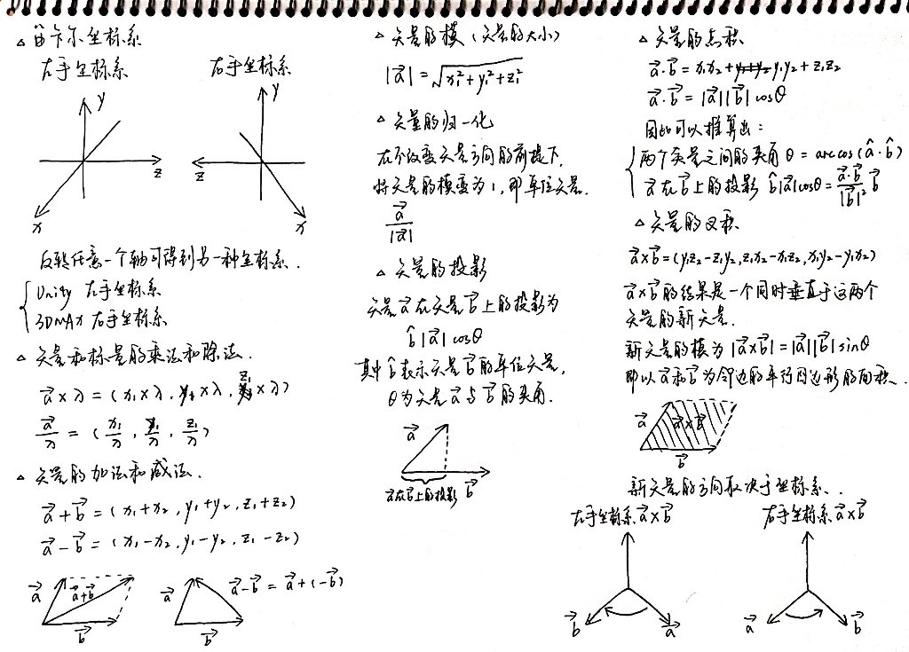

> 参考资料：《VR开发实战》

## Day 3：VR Hello World

* **Vive 开发环境搭建：**

    - 获取 SteamVR 插件
    - 将 SteamVR 插件导入 Unity
    - 认识 SteamVR 包

* **实现一个最基本的 VR 场景**
* **了解常用的 SteamVR 组件：**

    - 预制体 `CameraRig`
    - 手柄控制脚本 `SteamVR_TrackedController.cs`
    - 手柄射线脚本 `SteamVR_LaserPointer.cs`

* **实现手柄与 VR 中物品的简单交互：拿、放、扔**
* **实现手柄发射器效果**

> 参考资料：《VR开发实战》

## Day 4：简单的解谜游戏

* 游戏策划和场景搭建（直接使用素材）
* **编写脚本并关联到游戏物品**
* **了解 Prefab 预制件的制作和使用**
* 调试游戏交互和运行效果

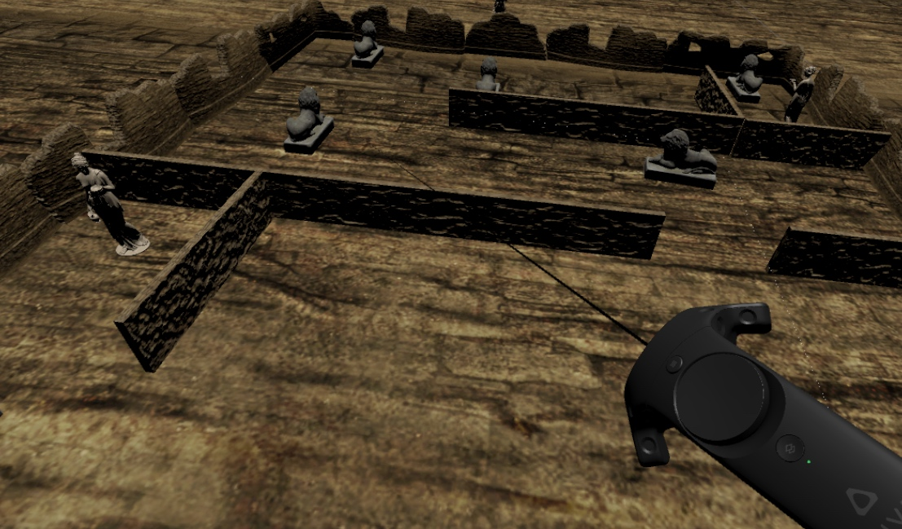

**项目源码：**[https://github.com/Caizc/learn-puzzle](https://github.com/Caizc/learn-puzzle)

> 参考资料：《VR开发实战》

## Day 5：第一人称射击游戏

* **创建怪物：**

    - 使用导航组件为怪物添加自动寻路
    - 创建动画控制器和添加行为控制逻辑
    - 添加怪物攻击逻辑

* **添加游戏管理类**
* **实现玩家攻击逻辑：**

    - 创建手枪动画控制器
    - 添加手枪开枪逻辑

* **实现游戏重玩逻辑**
* **添加背景音乐与调节音量**

**重点：**

* 《VR开发实战》书中的有很多刊误，有些步骤按照书中所写无法执行，需要变通，自己查阅资料和摸索得到正确的做法。
* 原 Demo 中使用的一些 API ，实际上 Unity 官方已有更新的版本，在学习时需要注意同步更新，使用最新的 API 进行编程。
* 学会如何在 Unity 和 MonoDevelop 上调试游戏程序和脚本，这是最重要的。

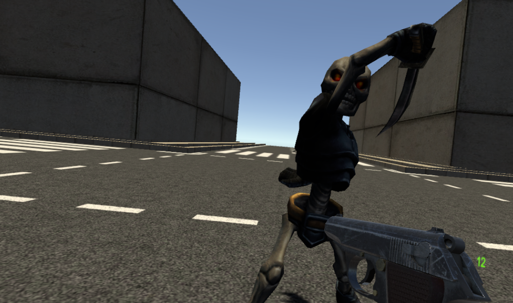

**项目源码：**[https://github.com/Caizc/learn-fps](https://github.com/Caizc/learn-fps)

> 参考资料：《VR开发实战》

## Day 6：旅游观光应用

* **实现游客在虚拟空间中的移动传送**
* **添加多场景管理**

    - 实现场景的动态加载和卸载

* **实现通过手柄方向盘对场景中光照角度的控制**
* **区分场景中可传送面和不可传送面**
* **修改手柄射线为抛物线**

**未解决的 bug ：**

* 使用 SteamVR 进行调试时，预制件 CameraRig 在编辑模式和 Play 模式下，Inspector 中的组件列表并不一致，这会导致运行时的效果与预期不一致，这个问题暂时还没有头绪，需要更深入地了解 Unity 引擎的运行机制才得以解答。
* 基于以上问题的存在，为了调试效果，尝试在 Play 模式下动态调整 Camera(head) 为 Enable，勾选后发现 Console 中持续报错：`Assertion failed on expression: 'IsMatrixValid (matrix)'`，且画面中手柄出现刷新卡顿，暂未找到解决方法。

**重点：**

* 使用 Visual Studio 作为 Unity 中 C# 脚本的编辑器进行开发和调试，提高生产效率。
* 安装 Visual Studio Tools for Unity，以便在 Visual Studio 中调试 C# 脚本。

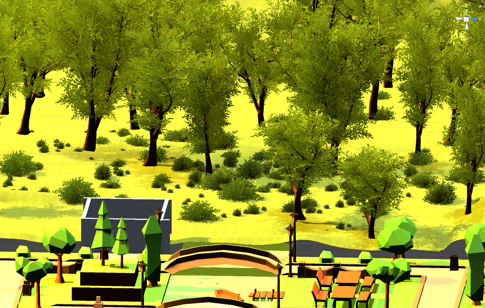

**项目源码：**[https://github.com/Caizc/learn-tourism](https://github.com/Caizc/learn-tourism)

> 参考资料：《VR开发实战》

## Day 7：将单机版的第一人称射击游戏改造成联机游戏

* **了解 Unity 提供的多玩家在线工具 UNET （ Unity Networking ），及其两个类型的API：HighLevelAPI 和 LowLevelAPI**

* **理解 HLAPI 中的几个重要概念：**

    - 主机、本地客户端、远程客户端、本地用户、权限
    - 主机与客户机之间的通信方式和数据同步方式
    - 如何产生联机物体

* **网络管理组件 NetworkManager**

    - 在场景中添加网络管理组件 NetworkManager 以及简单的联机控制 UI —— NetworkManagerHUD
    - 两个重要的属性：SpawnInfo 和 Registered Spawnable Prefabs

* **添加玩家控制器来控制玩家的所有网络行为，使用网络组件的特有属性来实现主机和客户端之间的远程调用和数据同步**
* **重写游戏管理逻辑**
* **为怪物添加网络通信组件**
* **设置玩家的固定出生点**

**未解决的 bug ：**

* 按照书中步骤配置好游戏对象以及控制脚本后，运行游戏后 Console 持续报错：`"There are no audio listeners in the scene. Please ensure there is always one audio listener in the scene."` Google 后无果。
* 另外，游戏不能正常运行，貌似存在不少 bug。
* 暂时搁置这个 demo，待更加深入地学习了 Unity 的运行机制后，再回过头来解决。

> 参考资料：《VR开发实战》

## Day 8：了解 Cardboard 开发、Oculus 开发和 MR 视频拍摄

阅读 **Cardboard** 开发、**Oculus** 开发和 **MR 视频**拍摄的入门知识，由于无相应硬件设备，暂时不做更深入的了解。

> 参考资料：《VR开发实战》

## Day 9：实现键鼠操控玩家对象在 3D 空间中自由移动

* **分解要构建的项目所需的步骤**
* **创建游戏场景：**

    - 创建地板、外墙和内墙
    - 设置场景中的灯光

* **编写用鼠标控制玩家角色视野的脚本 MouseLook.cs**

    - 使用 `Input.GetAxis("Mouse X")` 获取鼠标的水平坐标值，实现玩家视野的水平旋转
    - 使用 `Input.GetAxis("Mouse Y")` 获取鼠标的竖直坐标值，实现玩家视野的竖直旋转
    - 实现玩家视野的同时水平和竖直旋转

* **编写用键盘控制玩家角色移动的脚本 FPSInput.cs**

    - 使用 `Input.GetAxis("Horizontal")` 和 `Input.GetAxis("Vertical")` 来获取键盘的水平和竖直方向的值，从而实现玩家的前后左右移动
    - 运用 `Time.deltaTime` 来避免玩家移动速率的「帧率依赖」，统一所有计算机上的移动速率
    - 使用 Character Controller 组件来实现碰撞检测
    - 给玩家对象增加重力，以保证其不会在空间中到处乱飞

**重点：**

* 在 3D 坐标空间中，使用坐标位置和向量来表达位置和移动，理解「左手坐标系」和「右手坐标系」的区别。
* 区分**「本地坐标」**和**「全局坐标」**。
* 在 Unity 中，我们一般选择**「米」**作为坐标系中的长度单位，但这不是强制的，只要你在整个场景中保持使用一样的单位即可。
* 使用 **Character Controller** 组件来让游戏对象表现得像一个玩家角色。
* Input 类有一系列方法用于处理输入设备（例如鼠标、键盘），使用 `float Input.GetAxis(string axisName);` 来获取相应坐标轴上的值，坐标轴的名称和设置可以在 Unity 菜单 Edit > Project Settings > Input 中找到。
* 了解**欧拉角（Euler angle）**和**四元数（Quaternion）**的概念。
* 在脚本的类声明之前添加 `RequireComponent()` 方法来确保脚本附加了其他需要的组件；添加 `AddComponentMenu()` 方法以在 Inspector 底部的 Add Component 组件菜单中添加一个自定义的组件链接。

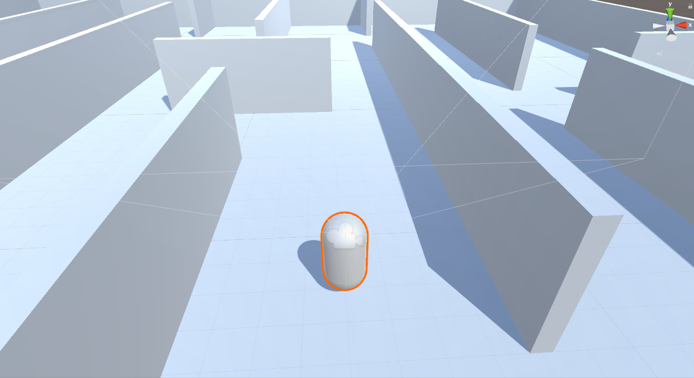

**项目源码：**[https://github.com/Caizc/learn-fps-play-with-km](https://github.com/Caizc/learn-fps-play-with-km)

> 参考资料：《Unity in Action: Multiplatform Game Development in C# with Unity 5》

## Day 10：为 FPS 游戏实现玩家射击和具有简单 AI 的敌人

* 通过射线射击
* 脚本化反应的目标
* 基本漫游 AI
* 产生敌人预设
* 通过实例化对象进行射击

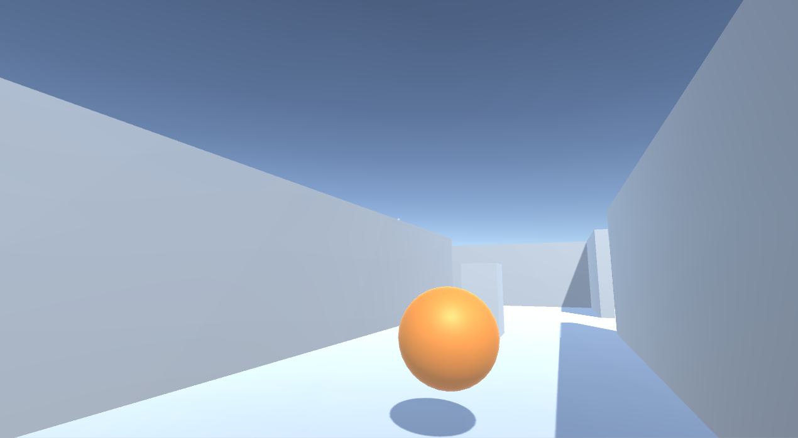

**项目源码：**[https://github.com/Caizc/learn-fps-play-with-km](https://github.com/Caizc/learn-fps-play-with-km)

> 参考资料：《Unity in Action: Multiplatform Game Development in C# with Unity 5》

## Day 11：为 FPS 游戏开发图形

* 了解美术资源
* 构建基础 3D 场景：白盒
* 使用 2D 图像给场景贴图
* 使用贴图图像产生天空视觉效果
* 使用自定义 3D 模型
* 使用粒子系统创建效果

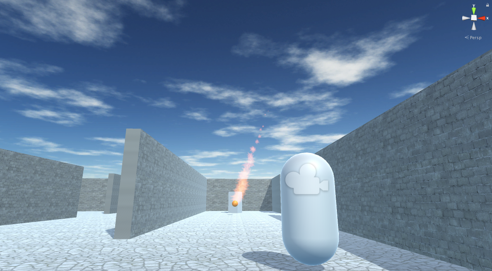

**项目源码：**[https://github.com/Caizc/learn-fps-play-with-km](https://github.com/Caizc/learn-fps-play-with-km)

> 参考资料：《Unity in Action: Multiplatform Game Development in C# with Unity 5》

## Day 12：2D 记忆力游戏

* 设置 2D 图像
* 构建卡片对象并让它响应单击
* 显示不同的卡片图像
* 实现匹配和匹配得分
* 重启按钮

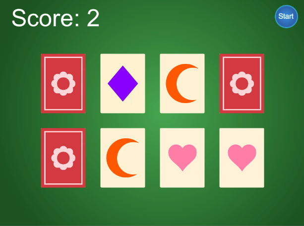

**项目源码：**[https://github.com/Caizc/learn-memory-game-2d](https://github.com/Caizc/learn-memory-game-2d)

> 参考资料：《Unity in Action: Multiplatform Game Development in C# with Unity 5》

## Day 13：为 3D 游戏创建 2D 的 GUI

* 认识 Unity 的 GUI 系统
* 创建用于界面的画布
* 通过锚点定位 UI 元素
* 为 UI 添加交互（按钮、滑动条等）
* 从 UI 广播和侦听事件

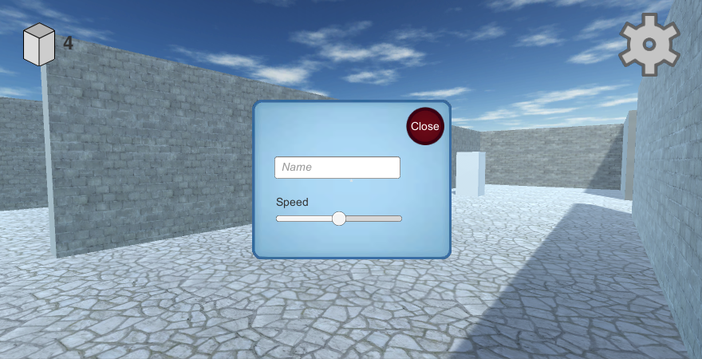

**项目源码：**[https://github.com/Caizc/learn-fps-play-with-km](https://github.com/Caizc/learn-fps-play-with-km)

> 参考资料：《Unity in Action: Multiplatform Game Development in C# with Unity 5》

## Day 14：实现第三人称 3D 游戏中玩家的移动和动画

* 将角色模型导入到场景
* 实现摄像机控制，以观察角色
* 编写脚本，让玩家能够在地面上跑
* 添加能够跳跃、移动的脚本
* 基于移动来播放模型的动画

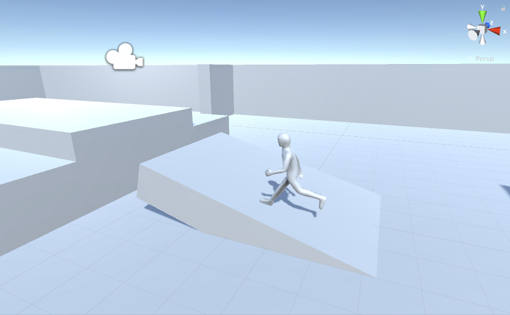

**项目源码：**[https://github.com/Caizc/learn-third-person-view-game](https://github.com/Caizc/learn-third-person-view-game)

> 参考资料：《Unity in Action: Multiplatform Game Development in C# with Unity 5》

## Day 15：在游戏中添加交互设施和物品

* 编写脚本，让玩家控制门的开关（通过按键或者进入触发区域）
* 创建响应物理碰撞的箱子
* 创建可收集的物品供玩家存储在仓库中
* 管理仓库数据和游戏状态
* 装备及使用仓库中的物品

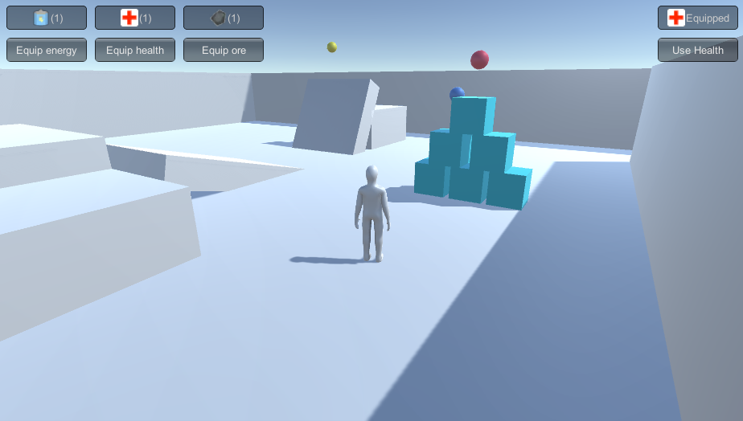

**项目源码：**[https://github.com/Caizc/learn-third-person-view-game](https://github.com/Caizc/learn-third-person-view-game)

> 参考资料：《Unity in Action: Multiplatform Game Development in C# with Unity 5》

## Day 16：将游戏连接到互联网

* 修改天空盒的 shader 来实现从晴天向阴天过渡的效果
* 从互联网服务获取实时的天气数据
* 解析 XML 或 JSON 格式的天气数据并应用于场景中的天空效果
* 从互联网下载图像并应用在场景中的物品上
* 将游戏中的数据发送到服务器上

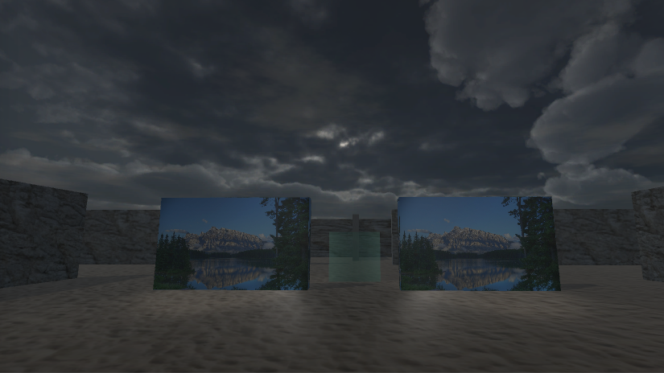

**项目源码：**[https://github.com/Caizc/learn-online-game](https://github.com/Caizc/learn-online-game)

> 参考资料：《Unity in Action: Multiplatform Game Development in C# with Unity 5》

## Day 17

> to be continued...

---

change log: 

	- 创建（2017-01-18）
	- 持续更新中...（2017-02-23）

---

