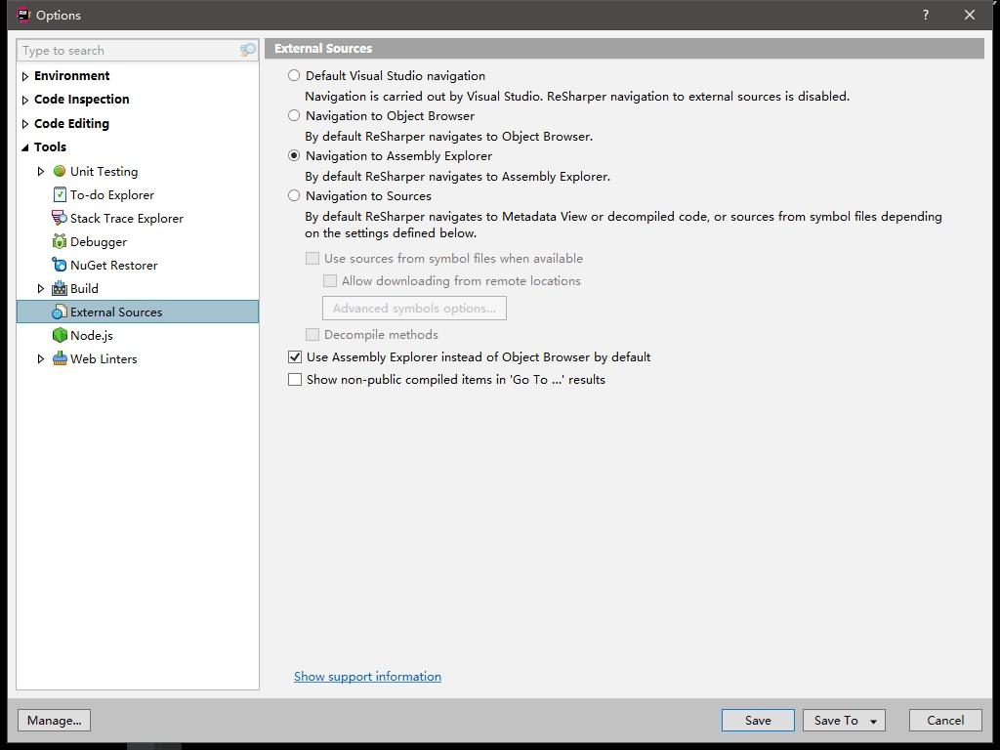

# Visual Studio & ReSharper Tips

## ReSharper 快捷键

[ReSharper的快捷键](https://my.oschina.net/u/935978/blog/131287)
[8项Resharper快捷键](http://www.cnblogs.com/redmoon/p/4458697.html)

* 编码援助

| 功能 | 快捷键 |
| --- | --- |
| 智能提示 | Alt + Enter |
| 重命名 | F2 |
| 重构工具 | Ctrl + Shift + R |
| 快速完成代码 | Alt + Insert |
| 新增一行 | Ctrl + Shift + Enter |
| Paste multiple | Ctrl + Shift + V |
| Duplicate a line or selection | Ctrl + D |
| Comment with line comment | Ctrl + / |
| Comment with block comment | Ctrl + Shift + / |
| 代码行上下移动 | Ctrl + Shift + Alt + Up/Down/Left/Right |
| 代码模板 | Ctrl + J |
| 格式化代码块 | Ctrl + K, Ctrl + F |
| 格式化整个文档 | Ctrl + K, Ctrl + D |
| Code cleanup | Ctrl + Alt + F |
| Silent code cleanup | Ctrl + Shift + Alt + F |
| 生成代码 | Alt + Insert |
| 根据模板创建文件 | Ctrl + Alt + Insert |
| 折叠所有大纲显示 | Ctrl + M, Ctrl + A |
| 展开所有大纲显示 | Ctrl + M, Ctrl + X |
| 展开当前区域 | Ctrl + M, Ctrl + E |

* 导航搜索

| 功能 | 快捷键 |
| --- | --- |
| 查找引用 | Ctrl + K, Ctrl + R |
| 查找引用 | Alt + F7 |
| 查找引用（高级） | Shift + Alt + F7 |
| Highlight usages in file |	Ctrl + Shift + F7 |
| Go to type | Ctrl + N |
| Go to file | Ctrl + Shift + N |
| Go to file member | Ctrl + F12 | 
| Go to symbol	 | Ctrl + Shift + Alt + N |
| Go to declaration | Ctrl + B |
| Go to implementation | Ctrl + Shift + Alt + B |
| Go to containing declaration | Ctrl + [ |
| View recent files | Ctrl + E |
| View recent edits | Ctrl + Shift + Alt + Backspace |
| 在解决方案管理器中定位正在编辑的文件 | Shift + Alt + L |
| 导航到上/下一个成员 | Alt + Up/Down |
| 导航到下一个代码问题 | F12 |
| 导航到下一个错误 | Alt + F12 |

* 代码分析

| 功能 | 快捷键 |
| --- | --- |
| File structure | Ctrl + F11 |
| View type hierarchy | Ctrl + Alt + H |

## Visual Studio 扩展插件

> 扩展 -> 管理扩展

* StyleCop
* [Visual Studio 主题设置文件下载 - studiostyles](https://studiostyl.es/)

## ReSharper 扩展插件

> 扩展 -> ReSharper -> Extension Manager...

> Tips：Visual Studio、ReSharper 以及 ReSharper Extension 三者的版本必须兼容，在 ReSharper Ultimate Extensions 中，不会显示版本不兼容的扩展，当然也就无法安装了。

* [ReSharper Plugins - jetbrains](https://plugins.jetbrains.com/resharper)

**JetBrains.ExtenalAnnotations**

**Unity Support**

* [resharper-unity - GitHub](https://github.com/JetBrains/resharper-unity)

**Heap Alllocations Viewer**

**Enhanced Tooltip**

## ReSharper 设置

* 文本编辑器中代码段颜色设置为使用 ReSharper 的配色方案：
> 扩展 -> ReSharper -> Options -> Code Inspection -> General -> 勾选 Color identifiers

* Unity Support 插件设置：
> 扩展 -> ReSharper -> Options -> Code Editing -> Unity Engine

## Visual Assist

* [Visual Assit 特性和技巧 - 知乎专栏](https://zhuanlan.zhihu.com/p/26643499)

## Trouble Shooting

* Unity 总是打开新的 Visual Studio 实例

[Unity keeps opening new instances of Microsoft Visual Studio](http://answers.unity3d.com/questions/1078859/unity-keeps-opening-new-instances-of-microsoft-vis.html)

* 显示所有打开的选项卡

[multiple rows of document or file tabs in visual studio IDE](https://stackoverflow.com/questions/37121040/multiple-rows-of-document-or-file-tabs-in-visual-studio-ide/40668536)

* 开启 ReSharper 的 Decompiler 代码反编译器

[How to enable the decompiler in ReSharper for Visual Studio](https://knowledge.zomers.eu/visualstudio/Pages/How-to-enable-the-decompiler-in-ReSharper-for-Visual-Studio.aspx)

---

change log: 

	- 创建（2017-08-22）
	- 更新（2019-02-11）
	- 新增 ReSharper 插件相关内容（2019-05-14）
	- 新增 Visual Assit 插件相关内容（2019-05-21）

---

