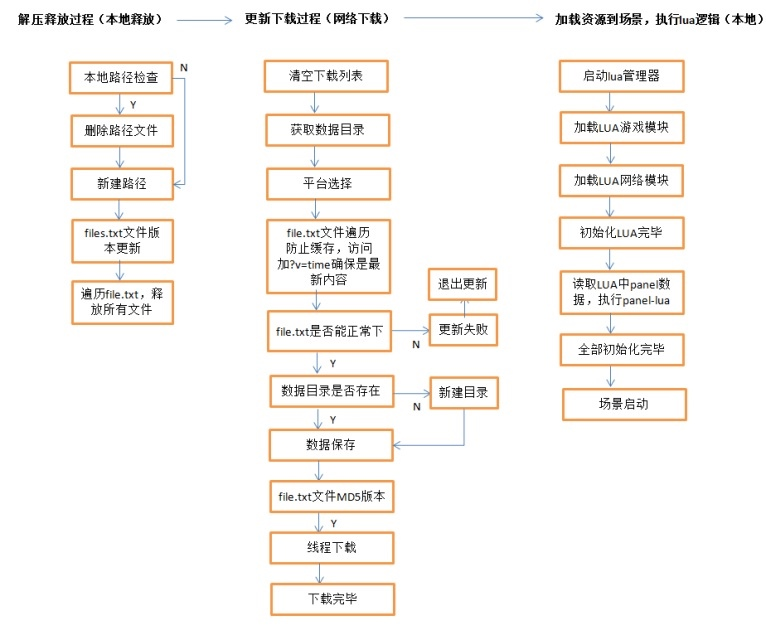
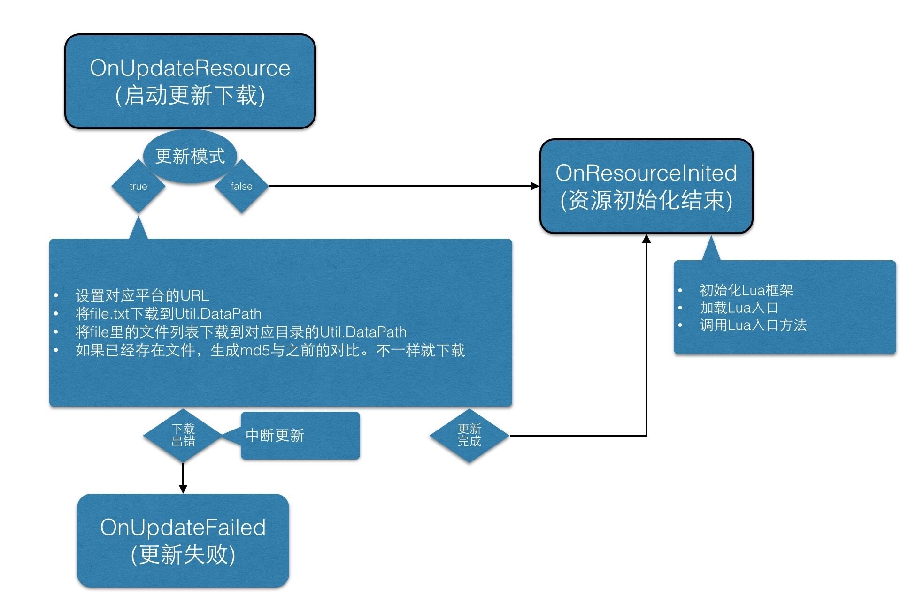

# uLua/toLua

# 学习资源

[LuaFramework_UGUI - GitHub](https://github.com/jarjin/LuaFramework_UGUI)
[uLua 文档资源汇总](http://doc.ulua.org/default.asp)
[uLua 视频教程 - 百度网盘](http://pan.baidu.com/s/1nu59wzJ)

[LuaFramework 入门之「代码热更新」](http://blog.sina.com.cn/s/blog_6788cd880102w8qy.html)
[LuaFramework 入门之「资源热更新」](http://blog.sina.com.cn/s/blog_6788cd880102w9jg.html)
[LuaFramework 入门之「Lua 逻辑编写」](http://blog.sina.com.cn/s/blog_6788cd880102wagh.html)
[LuaFramework 入门之「Lua 组件」](http://blog.sina.com.cn/s/blog_6788cd880102wbc0.html)
[LuaFramework 入门之「UI」](http://blog.sina.com.cn/s/blog_6788cd880102wc4j.html)

[游戏框架记录 + tolua - CSDN 博客](http://blog.csdn.net/u010665359/article/category/5926349)

[UnityHello 示例项目 - GitHub](https://github.com/woshihuo12/UnityHello)

# 核心难点

* Lua 与 C# 相互调用原理
* Unity 资源管理机制
* PureMVC
* 「热更新」原理

# LuaFramework 基础用法

[LuaFramework 的基础用法](http://doc.ulua.org/article/ulua/luaframeworkdejichuyongfa.html)

* 执行菜单“Lua/Generate All”，生成所有相关 wrap 文件。
* 执行菜单“LuaFramework/Build xxx Resource”，根据配置将素材文件 + lua 代码统一 build 到StreamingAssets 目录下面去。
* 运行游戏。会执行素材解包流程，如果是 Windows，会释放到“c:/luaframework”下面。安卓与iOS 都会释放到沙盒目录下，mac 会释放到当前框架目录下。框架会加载解包目录下面的素材 + lua 文件。
* 执行菜单“Lua/Clear wrap files”会将第一步生成的 wrap 清除掉，如果 c# 提供给 lua 的函数发生变化，一定要先 clear 后，再执行第一步，否则不会生效。 

# 框架结构说明

[SimpleFramework_NGUI 框架结构说明](http://doc.ulua.org/article/ngui/simpleframework_base1.html)

# 「热更新」流程





# PureMVC

[The PureMVC Framework](http://puremvc.org/)
[实战 PureMVC - IBM developerWorks](https://www.ibm.com/developerworks/cn/java/j-lo-puremvc/index.html)
[PureMVC 一款多平台 MVC 框架 - 简书](http://www.jianshu.com/p/47deaced9eb3)

前置知识：设计模式

# 备忘

```csharp
public const string WebUrl = "http://caizicong.com:8080/protonserver/StreamingAssets/";      //测试更新地址
```

---

change log: 

	- 创建（2017-12-06）

---

