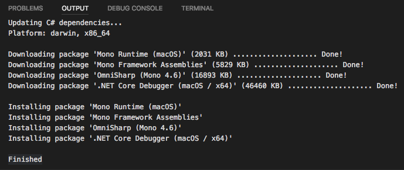
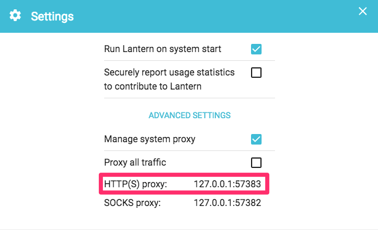

# 如何加快 Visual Studio Code 插件更新速度

由于众所周知的原因，Visual Studio Code 在更新插件或者依赖包时，如果使用的是国内网络，整个下载包的过程很可能会非常漫长，虽然包大小只有区区几十 M。



如果你是「科学上网」，可以如下在 Visual Studio Code 的设置里修改 `http.proxyStrictSSL` 属性为 `false`，并且将 `http.proxy` 属性设置为「科学上网」软件（例如 Lantern）的代理地址和端口，以加快插件更新的速度。



```json
{
    "http.proxyStrictSSL": false,
    "http.proxy": "http://127.0.0.1:57383"
}
```

> **相关链接：**
> [Improve experience downloading C# dependencies over slow internet #1085](https://github.com/OmniSharp/omnisharp-vscode/issues/1085)
> [How to install plugins behind a proxy with a self-signed certificate? #155](https://github.com/Microsoft/vscode/issues/155)


---

change log: 

	- 创建（2017-06-06）

---


